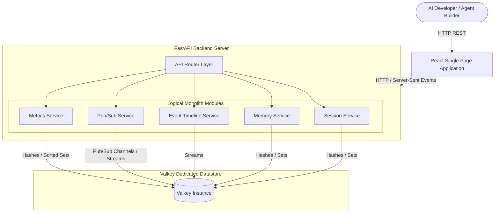
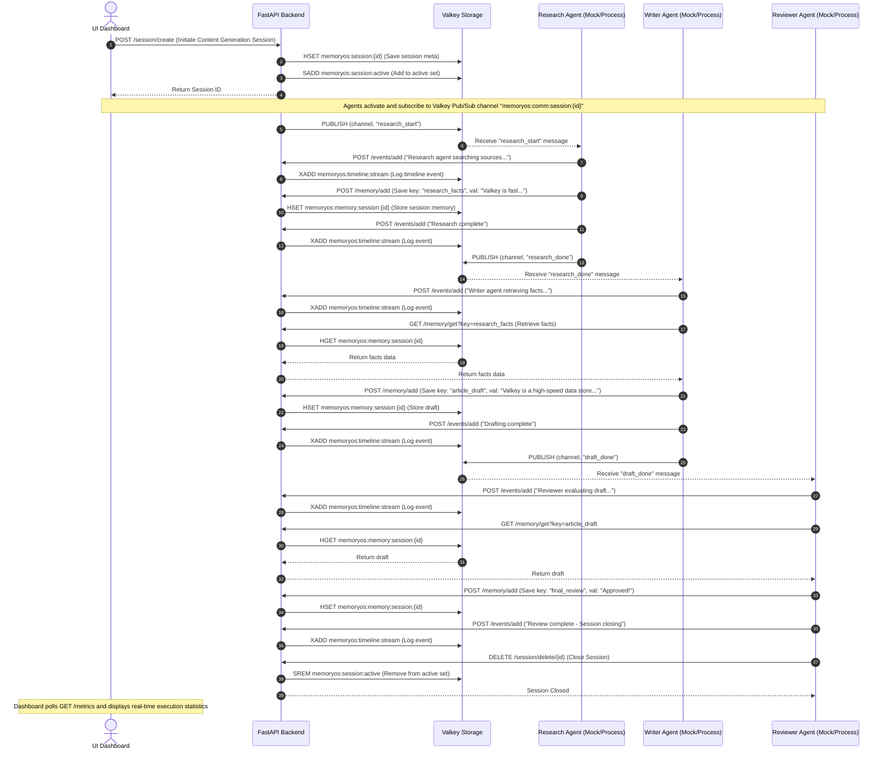

# Architecture Document - MemoryOS

This document defines the high-level architecture, module boundaries, database paradigm, and data flows for **MemoryOS**.

---

## 1. System Context & Topology

MemoryOS is structured as a **Modular Monolith**. This architecture choice ensures high cohesion, rapid development, and simple deployments, while strictly isolating responsibilities into clean logical submodules.



- **Frontend (React + Tailwind + Recharts)**: Displays session states, active agent lists, live timelines, and metrics charts. It reads from REST endpoints and uses Server-Sent Events (SSE) for live streaming updates.
- **Backend (FastAPI)**: Serves the REST API. Contains a centralized connection pool to Valkey and delegates tasks to specific services.
- **Storage (Valkey ONLY)**: The single source of truth for the application. No relational databases, document databases, or third-party message brokers are permitted.

---

## 2. Monolithic Module Boundaries

The backend code is divided into logical modules. Each module encapsulates its data access logic and limits inter-module calls to clear service-level APIs.

```
memoryos/
├── backend/
│   ├── app/
│   │   ├── main.py                # App entrypoint & middleware
│   │   ├── config.py              # Application settings (Valkey connection config)
│   │   ├── session/               # Session Service (Lifecycle management)
│   │   │   ├── router.py
│   │   │   └── service.py
│   │   ├── memory/                # Memory Service (Session context & shared agent memory)
│   │   │   ├── router.py
│   │   │   └── service.py
│   │   ├── timeline/              # Event Timeline Service (Chronological streams)
│   │   │   ├── router.py
│   │   │   └── service.py
│   │   ├── pubsub/                # Pub/Sub Service (Inter-agent communication)
│   │   │   └── service.py
│   │   └── metrics/               # Metrics Service (Telemetry & statistics)
│   │       ├── router.py
│   │       └── service.py
```

### 2.1 Session Service
- **Responsibility**: Tracks execution sessions.
- **Valkey Structures**: Hashes for metadata storage; Sets for tracking active/historic session lists.
- **Internal APIs**: Exposes methods to create, fetch, and expire sessions.

### 2.2 Memory Service
- **Responsibility**: Manages short-term (session-locked) context and long-term (global shared) state.
- **Valkey Structures**: Hashes for context storage; Sets for indexing memories by tags.
- **Internal APIs**: Exposes interfaces for saving and fetching key-value data scoped globally or by session.

### 2.3 Event Timeline Service
- **Responsibility**: Appends ordered state logs representing agent steps, tool executions, and system milestones.
- **Valkey Structures**: Streams for high-speed chronological appends and real-time consumption.
- **Internal APIs**: Exposes event-appending endpoints and streaming search routines.

### 2.4 Pub/Sub Service
- **Responsibility**: Distributes messages between collaborative agents in real-time.
- **Valkey Structures**: Valkey native Pub/Sub channels for fast, fire-and-forget message distribution.
- **Internal APIs**: Allows backend endpoints or active client streams to publish messages to agent channels.

### 2.5 Metrics Service
- **Responsibility**: Monitors system load, operational count, and telemetry.
- **Valkey Structures**: Hashes for counter tracking; Sorted Sets for time-series aggregation.
- **Internal APIs**: Integrates as FastAPI middleware to log API requests and latency metrics, incrementing counters in Valkey.

---

## 3. End-to-End Demo Sequence (Research -> Writer -> Reviewer)

The following sequence diagram outlines the interactive workflow demo showing how the different services interact during a typical multi-agent orchestration session:



---

## 4. Frontend Component Interface

The frontend is built as a single-page dashboard designed to show live telemetry.

```
memoryos/frontend/src/
├── components/
│   ├── SessionManager.jsx      # Controls creation/teardown & session listings
│   ├── EventTimeline.jsx       # Renders streaming chronologic timeline
│   ├── MessageStream.jsx       # Displays real-time agent pub/sub interactions
│   └── MetricsDashboard.jsx    # Displays Recharts visual statistics
```

- **Metrics Charts**: Recharts line-charts trace "Event Frequency over Time" and bar-charts trace "Valkey Memory Footprint".
- **Visual Flow Map**: A graphical pipeline highlighting which node (Research, Writer, Reviewer) is active, updated in real time via event triggers.
