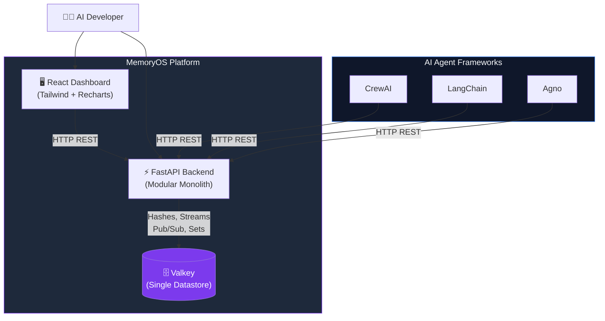
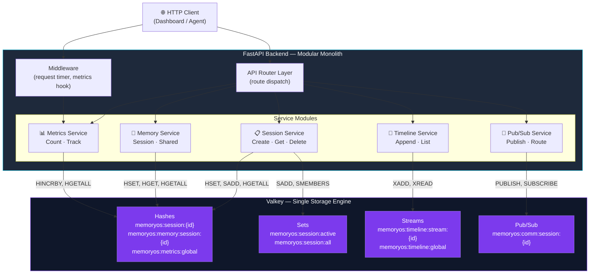
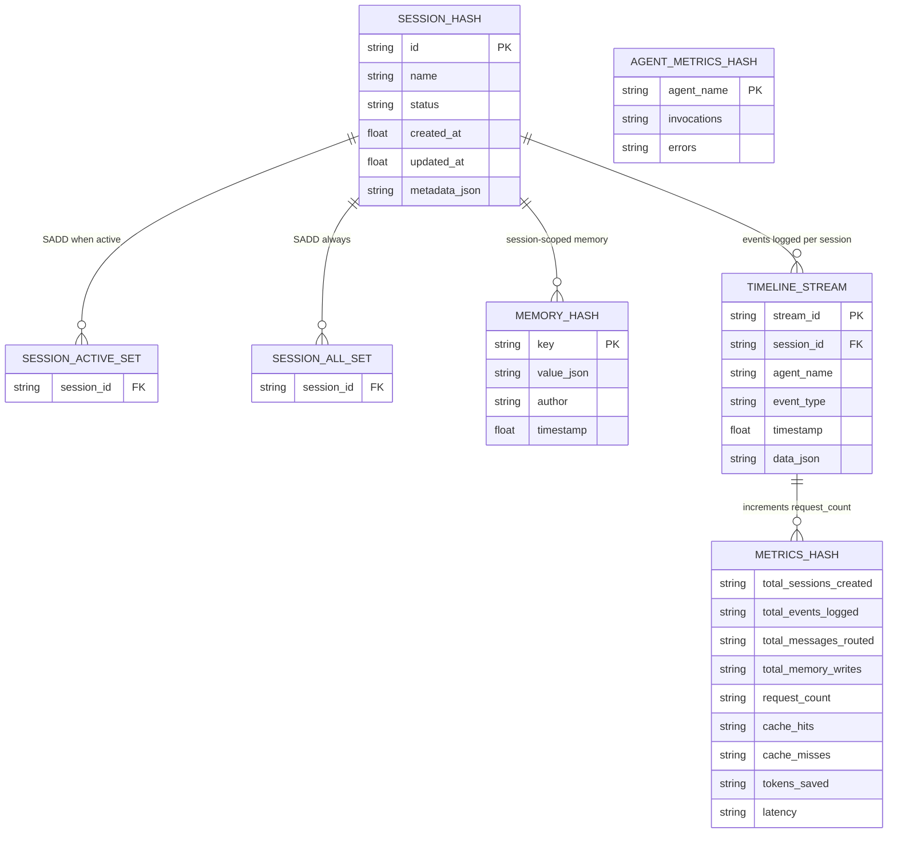
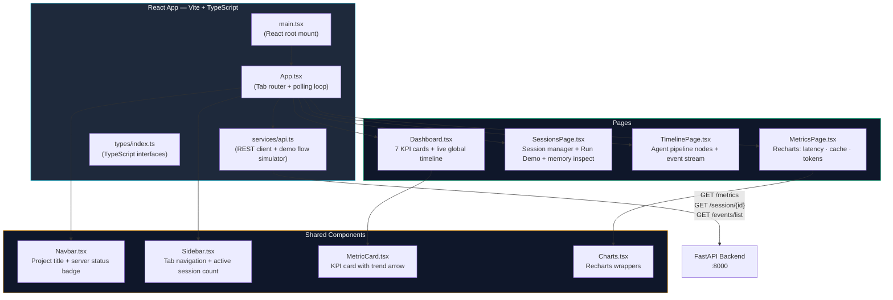
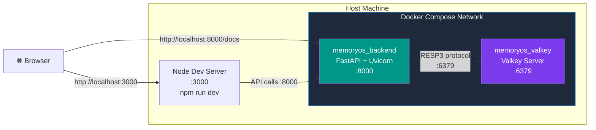

# MemoryOS — Architecture Diagrams

This document contains all Mermaid architecture diagrams for MemoryOS.

---

## 1. System Context Diagram

High-level view of how MemoryOS fits into the AI agent ecosystem.

---

## 2. Modular Monolith Component Diagram

Internal structure of the FastAPI backend — showing module boundaries and Valkey interactions.

---

## 3. End-to-End Agent Flow: Research → Writer → Reviewer

Sequence diagram showing the complete multi-agent pipeline.

```mermaid
sequenceDiagram
    autonumber
    actor Dev as Developer / Dashboard
    participant API as FastAPI Backend
    participant VK as Valkey
    participant RA as Research Agent
    participant WA as Writer Agent
    participant RevA as Reviewer Agent

    Dev->>API: POST /session/create
    API->>VK: HSET memoryos:session:{id}
    API->>VK: SADD memoryos:session:active
    API-->>Dev: { session_id }

    Note over RA,RevA: All agents subscribe to session Pub/Sub channel

    rect rgb(30, 58, 138)
        Note over RA: Research Phase
        RA->>API: POST /events/add (task_start)
        API->>VK: XADD memoryos:timeline:stream:{id}
        RA->>API: POST /memory/add (key=research_facts)
        API->>VK: HSET memoryos:memory:session:{id}
        RA->>API: POST /events/add (task_complete)
        API->>VK: XADD memoryos:timeline:stream:{id}
        RA->>VK: PUBLISH channel "research_done"
    end

    rect rgb(6, 78, 59)
        Note over WA: Writing Phase
        VK-->>WA: Receive "research_done"
        WA->>API: GET /memory/get?scope=session&session_id={id}
        API->>VK: HGET memoryos:memory:session:{id}
        VK-->>API: { research_facts }
        API-->>WA: { research_facts }
        WA->>API: POST /memory/add (key=article_draft)
        API->>VK: HSET memoryos:memory:session:{id}
        WA->>API: POST /events/add (task_start)
        API->>VK: XADD memoryos:timeline:stream:{id}
        WA->>API: POST /events/add (task_complete)
        API->>VK: XADD memoryos:timeline:stream:{id}
        WA->>VK: PUBLISH channel "draft_done"
    end

    rect rgb(88, 28, 135)
        Note over RevA: Review Phase
        VK-->>RevA: Receive "draft_done"
        RevA->>API: GET /memory/get?scope=session&session_id={id}
        API->>VK: HGET memoryos:memory:session:{id}
        VK-->>API: { article_draft }
        API-->>RevA: { article_draft }
        RevA->>API: POST /memory/add (key=final_review)
        API->>VK: HSET memoryos:memory:session:{id}
        RevA->>API: POST /events/add (task_start)
        API->>VK: XADD memoryos:timeline:stream:{id}
        RevA->>API: POST /events/add (task_complete)
        API->>VK: XADD memoryos:timeline:stream:{id}
    end

    Dev->>API: GET /metrics
    API->>VK: HGETALL memoryos:metrics:global
    VK-->>API: { request_count, events, cache_hits, ... }
    API-->>Dev: Live metrics dashboard update
```

---

## 4. Valkey Data Model Diagram

How each MemoryOS service maps to Valkey data structures.

---

## 5. Frontend Component Architecture

---

## 6. Docker Compose Deployment Diagram

