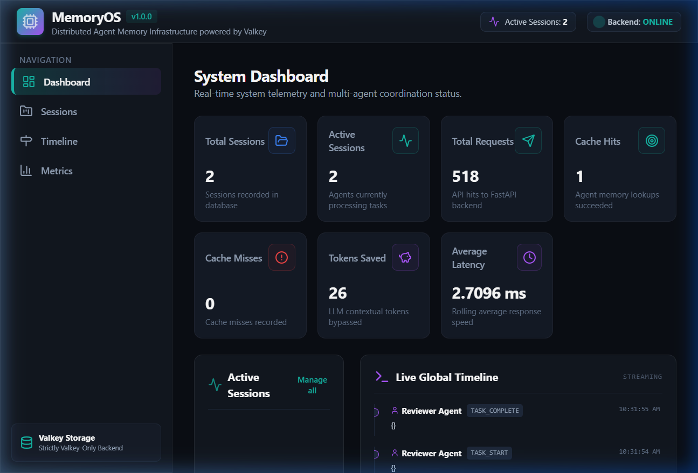
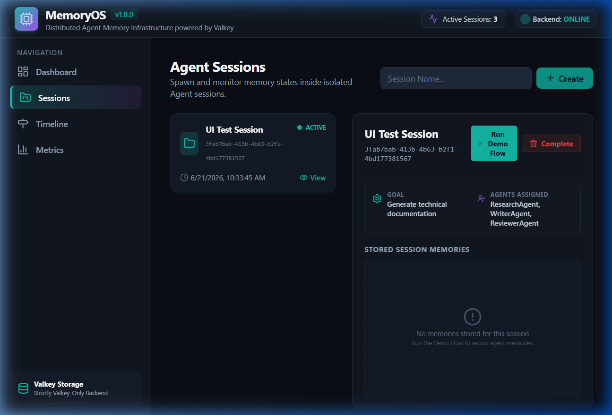
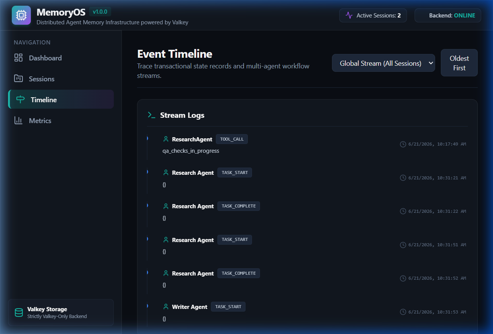
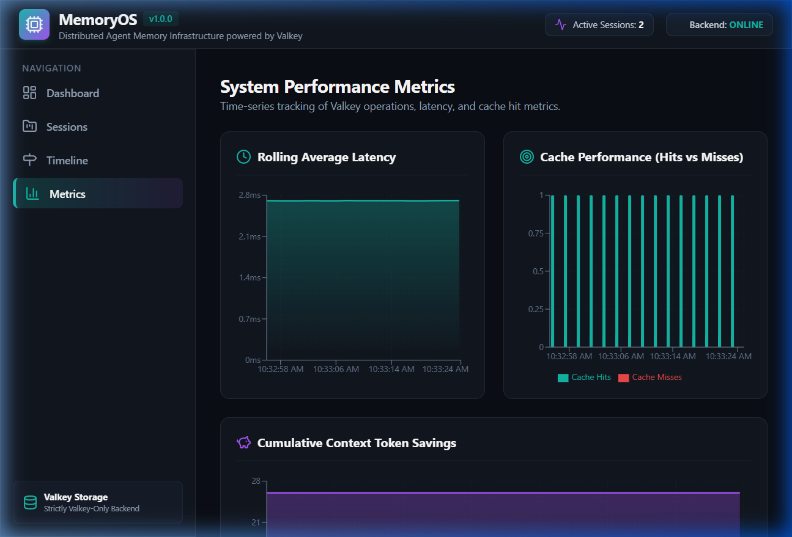

<div align="center">

# 🧠 MemoryOS

### Distributed Memory Infrastructure for AI Agents — Powered by Valkey

[](https://opensource.org/licenses/MIT)
[](https://valkey.io)
[](https://fastapi.tiangolo.com)
[](https://react.dev)
[](https://valkey.io)
[](https://docker.com)

> **Built for the Valkey Build Beyond Limits 2.0 Hackathon**

</div>

---

## 🚨 The Problem

AI agent orchestration systems (CrewAI, LangChain, Agno) hit severe walls at scale:

| Problem | Impact |
|---|---|
| **Context Fragmentation** | Agents lose shared state when sessions reset or nodes restart |
| **Slow Coordination** | SQL databases add 5–50ms query latency per agent step |
| **Black-box Operations** | No unified timeline to debug agent-to-agent interactions |
| **Complex Infrastructure** | Kafka + Postgres + Vector DB = 3 separate systems to operate |

**MemoryOS solves this with a single, unified, high-performance layer** — powered exclusively by Valkey.

---

## ✨ What is MemoryOS?

MemoryOS is a **Distributed Memory Infrastructure for AI Agents**. It provides:

- 🗂️ **Session Memory** — Fast agent session creation, tracking, and teardown
- 🔗 **Shared Agent Memory** — Cross-agent global memory with key-value tagging
- 📜 **Event Timeline** — Ordered, chronological agent execution logs via Valkey Streams
- 📡 **Pub/Sub Communication** — Real-time inter-agent messaging via Valkey native Pub/Sub
- 📊 **Metrics & Telemetry** — API latency, cache efficiency, token savings, event throughput
- 🖥️ **Live Dashboard** — React-powered SPA with Recharts visualization

**Zero SQL. Zero Kafka. Zero Vector DB. Only Valkey.**

---

## 🏗️ Architecture

MemoryOS is a **Modular Monolith**: a single deployable unit with clean internal module boundaries.

```
┌─────────────────────────────────────────────────────────┐
│                   AI Developer / Agent Builder           │
└──────────────────────────┬──────────────────────────────┘
                           │ HTTP REST
              ┌────────────▼─────────────┐
              │  React SPA (Dashboard)    │
              │  Tailwind + Recharts      │
              └────────────┬─────────────┘
                           │ HTTP REST / Polling
              ┌────────────▼─────────────┐
              │   FastAPI Backend         │
              │   Modular Monolith        │
              │                           │
              │  ┌─────────────────────┐  │
              │  │  Session Service    │  │
              │  │  Memory Service     │  │
              │  │  Timeline Service   │  │
              │  │  Pub/Sub Service    │  │
              │  │  Metrics Service    │  │
              │  └────────┬────────────┘  │
              └───────────┼───────────────┘
                          │
              ┌───────────▼───────────────┐
              │   Valkey (Single Storage) │
              │                           │
              │  Hashes → Sessions        │
              │  Hashes → Memory          │
              │  Streams → Timeline       │
              │  Pub/Sub → Comms          │
              │  Hashes → Metrics         │
              └───────────────────────────┘
```

### Valkey Data Model

| Data | Valkey Structure | Key Pattern |
|---|---|---|
| Session metadata | Hash | `memoryos:session:{id}` |
| Session index | Set | `memoryos:session:active`, `memoryos:session:all` |
| Session memory | Hash | `memoryos:memory:session:{id}` |
| Shared memory | Hash | `memoryos:memory:shared` |
| Event timeline | Stream | `memoryos:timeline:stream:{session_id}` |
| Global timeline | Stream | `memoryos:timeline:global` |
| Global metrics | Hash | `memoryos:metrics:global` |
| Agent metrics | Hash | `memoryos:metrics:agents` |

---

## 🚀 Features

### Session Management
- Create named sessions with custom metadata
- Track active/historic sessions via Valkey Sets
- Gracefully delete/expire sessions

### Agent Memory
- **Session-scoped memory**: Short-term context linked to a session ID
- **Shared global memory**: Long-term cross-agent state with tags
- Author tracking and timestamp metadata on every entry

### Event Timeline Service
- Append ordered execution events using Valkey Streams (`XADD`)
- Filter events by session ID
- Real-time stream support for live dashboard updates

### Pub/Sub Communication
- Route messages between agents via dynamic Valkey channels
- REST API wrapper for publish operations
- All transmissions logged to the metrics engine

### Metrics & Observability
- Request count, cache hits/misses, latency tracking
- Token savings estimation
- Per-agent invocation counters
- All stored as Valkey Hash counters — no external APM needed

### Live Dashboard
- 7 KPI metric cards updated in real-time
- Global scrolling event timeline
- Sessions manager with inline memory inspection
- Recharts: latency area chart, cache bar chart, token savings accumulation

---

## 🖥️ Screenshots

| Dashboard | Sessions |
|---|---|
|  |  |

| Timeline | Metrics |
|---|---|
|  |  |

---

## 📁 Project Structure

```
memoryos/
├── PRD.md                          # Product Requirements Document
├── ARCHITECTURE.md                 # Architecture Design Document
├── SCHEMA.md                       # Valkey Data Schema Reference
├── API_CONTRACT.md                 # REST API Contract Specification
├── TEST_PLAN.md                    # QA Test Plan
├── README.md                       # This file
│
├── backend/
│   ├── api/                        # FastAPI route handlers
│   │   ├── session.py              # POST /session/create, GET, DELETE
│   │   ├── memory.py               # POST /memory/add, GET /memory/get
│   │   ├── events.py               # POST /events/add, GET /events/list
│   │   ├── pubsub.py               # POST /pubsub/publish
│   │   └── metrics.py              # GET /metrics
│   ├── services/                   # Business logic layer
│   │   ├── session_service.py
│   │   ├── memory_service.py
│   │   ├── event_service.py
│   │   ├── pubsub_service.py
│   │   └── metrics_service.py
│   ├── schemas/                    # Pydantic request/response models
│   │   ├── session.py
│   │   ├── memory.py
│   │   ├── event.py
│   │   └── metrics.py
│   ├── valkey_client/              # Centralized Valkey connection pool
│   │   └── client.py
│   ├── core/                       # App config and middleware
│   ├── tests/                      # Pytest test suite
│   ├── main.py                     # FastAPI entrypoint
│   ├── requirements.txt
│   ├── Dockerfile
│   └── docker-compose.yml
│
└── frontend/
    ├── src/
    │   ├── components/             # Reusable UI components
    │   │   ├── Navbar.tsx
    │   │   ├── Sidebar.tsx
    │   │   ├── MetricCard.tsx
    │   │   └── Charts.tsx
    │   ├── pages/                  # Page-level views
    │   │   ├── Dashboard.tsx
    │   │   ├── SessionsPage.tsx
    │   │   ├── TimelinePage.tsx
    │   │   └── MetricsPage.tsx
    │   ├── services/
    │   │   └── api.ts              # REST API client + demo flow simulator
    │   ├── types/
    │   │   └── index.ts            # TypeScript interfaces
    │   └── App.tsx                 # Root app with tab routing
    ├── tailwind.config.js
    ├── vite.config.ts
    └── package.json
```

---

## ⚡ Quick Start

### Prerequisites

- [Docker Desktop](https://www.docker.com/products/docker-desktop/) (with Docker Compose)
- [Node.js 18+](https://nodejs.org/) (for frontend dev server)
- Python 3.10+ (optional, for running tests locally)

### 1. Clone the Repository

```bash
git clone https://github.com/your-username/memoryos.git
cd memoryos
```

### 2. Start the Backend with Docker Compose

```bash
cd backend
docker compose up --build -d
```

This starts:
- `memoryos_backend` — FastAPI server on `http://localhost:8000`
- `memoryos_valkey` — Valkey instance on port `6379`

Verify both containers are running:

```bash
docker ps
```

Expected output:
```
NAMES              STATUS          PORTS
memoryos_backend   Up X minutes    0.0.0.0:8000->8000/tcp
memoryos_valkey    Up X minutes    0.0.0.0:6379->6379/tcp
```

### 3. Verify the API

Open the interactive Swagger docs:

```
http://localhost:8000/docs
```

Or test with curl:

```bash
curl http://localhost:8000/
# {"service":"MemoryOS API","version":"1.0.0","status":"online"}
```

### 4. Start the Frontend

```bash
cd frontend
npm install
npm run dev
```

Open the dashboard at:

```
http://localhost:3000
```

---

## 📡 API Reference

### Session Service

| Method | Endpoint | Description |
|---|---|---|
| `POST` | `/session/create` | Create a new agent session |
| `GET` | `/session/{id}` | Get session details by ID |
| `DELETE` | `/session/delete/{id}` | Delete/close a session |

**Create Session**
```json
POST /session/create
{
  "name": "Content Generation Session",
  "metadata": { "goal": "research and write article" }
}
```

### Memory Service

| Method | Endpoint | Description |
|---|---|---|
| `POST` | `/memory/add` | Store session or shared memory |
| `GET` | `/memory/get` | Retrieve memory by scope/session |

**Add Memory**
```json
POST /memory/add
{
  "scope": "session",
  "session_id": "uuid-here",
  "key": "research_facts",
  "value": "Valkey is fast...",
  "author": "Research Agent",
  "tags": ["research", "valkey"]
}
```

### Event Timeline

| Method | Endpoint | Description |
|---|---|---|
| `POST` | `/events/add` | Log a timeline event |
| `GET` | `/events/list` | List events by session ID |

### Metrics

| Method | Endpoint | Description |
|---|---|---|
| `GET` | `/metrics` | Get global metrics and agent stats |

---

## 🎭 End-to-End Demo Flow

MemoryOS includes a built-in demo simulating a **Research → Writer → Reviewer** multi-agent pipeline.

**Trigger via UI:** Click **"Run Demo Flow"** on the Sessions page.

**Or trigger via API:**

```bash
# 1. Create session
SESSION=$(curl -s -X POST http://localhost:8000/session/create \
  -H "Content-Type: application/json" \
  -d '{"name": "Demo Session", "metadata": {}}' | python -c "import sys,json; print(json.load(sys.stdin)['id'])")

# 2. Research Agent stores facts
curl -s -X POST http://localhost:8000/memory/add \
  -H "Content-Type: application/json" \
  -d "{\"scope\":\"session\",\"session_id\":\"$SESSION\",\"key\":\"research_facts\",\"value\":\"Valkey is fast\",\"author\":\"Research Agent\"}"

# 3. Log events
curl -s -X POST http://localhost:8000/events/add \
  -H "Content-Type: application/json" \
  -d "{\"session_id\":\"$SESSION\",\"agent_name\":\"Research Agent\",\"event_type\":\"task_complete\",\"data\":{\"action\":\"Research done\"}}"

# 4. Check metrics
curl -s http://localhost:8000/metrics | python -m json.tool
```

---

## 🧪 Running Tests

```bash
cd backend
pip install -r requirements.txt
pytest -v
```

Expected: All tests pass (`PASSED` status, 0 failures).

---

## 🛠️ Tech Stack

| Layer | Technology | Purpose |
|---|---|---|
| **Storage** | [Valkey 7.x/8.x](https://valkey.io) | Single source of truth — Hashes, Streams, Pub/Sub, Sets |
| **Backend** | [FastAPI](https://fastapi.tiangolo.com) + Python 3.10 | Async REST API |
| **Validation** | [Pydantic v2](https://docs.pydantic.dev) | Request/response schema validation |
| **Frontend** | [React 18](https://react.dev) + TypeScript | Single-page dashboard application |
| **Styling** | [Tailwind CSS](https://tailwindcss.com) | Utility-first CSS framework |
| **Charts** | [Recharts](https://recharts.org) | Declarative chart components |
| **Build** | [Vite](https://vitejs.dev) | Fast frontend build tool |
| **Packaging** | [Docker Compose](https://docs.docker.com/compose/) | Single-command deployment |

---

## 🏆 Why Valkey?

MemoryOS is built around Valkey's native data structures — not as a cache, but as the **primary application database**:

| Use Case | Valkey Feature | Why It Fits |
|---|---|---|
| Session tracking | `HSET` / `SADD` | O(1) reads/writes for metadata |
| Agent memory | Hash per session | Atomic field updates, namespaced keys |
| Event timeline | `XADD` / `XREAD` | Ordered, append-only event log with consumer groups |
| Inter-agent comms | Native Pub/Sub | Zero-latency fire-and-forget messaging |
| Metrics counters | `HINCRBY` | Atomic integer increments, no locking |

**Result**: Sub-millisecond p99 latency across all agent operations.

---

## 📋 Design Documents

All Phase 1 design documents are located in the project root:

- [`PRD.md`](PRD.md) — Product Requirements Document
- [`ARCHITECTURE.md`](ARCHITECTURE.md) — System Architecture & Mermaid Diagrams
- [`SCHEMA.md`](SCHEMA.md) — Valkey Key/Data Schema Reference
- [`API_CONTRACT.md`](API_CONTRACT.md) — REST API Contract Specification
- [`TEST_PLAN.md`](TEST_PLAN.md) — QA Test Strategy & Test Cases

---

## 🔐 Security Notes

- **No authentication**: Endpoints are intentionally public for simplified VPC-internal deployment.
- **No secrets**: No API keys, passwords, or tokens in this repository.
- **No external connections**: The backend only connects to the local Valkey container.

---

## 📜 License

MIT License. See [LICENSE](LICENSE) for details.

---

<div align="center">

**Built with ❤️ for the Valkey Build Beyond Limits 2.0 Hackathon**

*MemoryOS — Because AI agents deserve better memory.*

</div>
